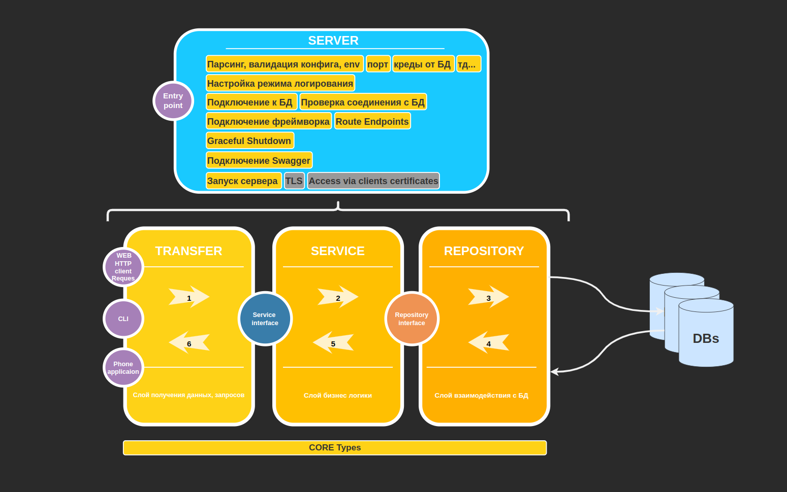
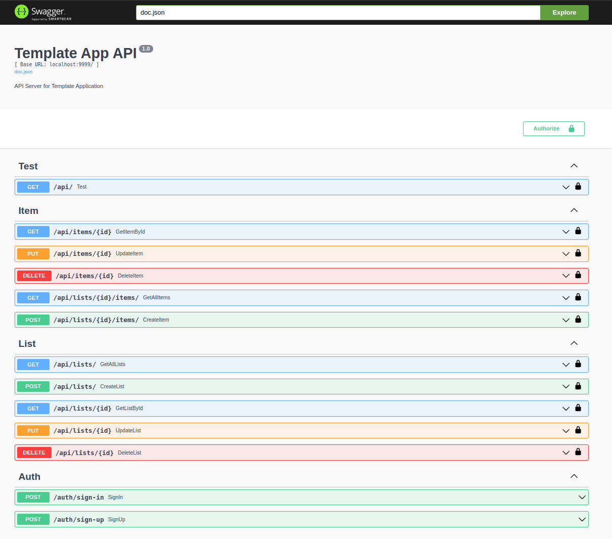

> # **Основные цели шаблона**

1. ### Реализация полноценного ***`Rest API`***
    - С описанием ендпоинтов, которые доступны в графическом интерфейсе через веб браузер. (Swagger)

2. ### Реализация взаимодействия с ***`базой данных`***
    - Postgres
    - Связь многие ко многим

3. ### Применение подходов ***`Clear Architecture`***, ***`Dependency Injection`***
    - Возможность безболезненно менять фреймворки и инфраструктурные элементы (БД)
    - Изолированное тестированние каждого слоя системы
    - Независимоть от пользовательского интерфеска (web, cli, phone app...)

---
> ## ***Шаблон реализует логику:***
1. `Авторизация` и `Аутентификация` на основе JWT-токенов
2. `Создание списков задач`, их сохранение в бд, модификация, удаление. Список задач связывается с пользователем, который его создал.
3. `Создание самих задач`, их сохранение в бд, модификация, удаление. Задачи связываются с определенным списком и пользователем.
---

> ## ***Описание директорий*** 

- cmd - содержит `точку входа`
- configs - `конфигурация` приложения
- docs - содержит схему и Swagger документацию(генерится автоматически)
- internal - вся внутренняя логика приложения    
  - transport - способы `получения данных` (http, grpc, cli...)
  - service - основная `бизнес логика` работы приложения
  - storage -  слой `взаимодействия` с различными БД (postgtres, mongo, local dir...)
- pkg - кастомные пакеты, которые могут быть `применены в других проектах`
- schema - содержит `миграции БД`

---
> ## ***Общая схема Микросервиса*** 

---
---
> ## ***Реализованные REST API endpoints в шаблоне (web interface generated by swagger)*** 

---

> ## ***Up your `skill`:***
1. Реализация полноценного Rest API
    - https://www.youtube.com/playlist?list=PLbTTxxr-hMmyFAvyn7DeOgNRN8BQdjFm8
    - https://www.youtube.com/watch?v=mesl2Si6saw

2. Прикручиваем `SWAGGER`
    - https://github.com/swaggo/swag
    - https://github.com/swaggo/echo-swagger
    - https://www.youtube.com/watch?v=DBZgt9iIWzk&list=PLbTTxxr-hMmyFAvyn7DeOgNRN8BQdjFm8&index=13
    - see [here](./docs/readme.md)

3. Топовый фреймворк для GO
    - https://echo.labstack.com/

4. Поднимаем `postgres`, настраиваем миграции
    - see [here](./schema/readme.md)

5. Правильное логирование
    - https://github.com/sirupsen/logrus

6. Стандартный макет проекта
    - https://github.com/golang-standards/project-layout/blob/master/README_ru.md

---
